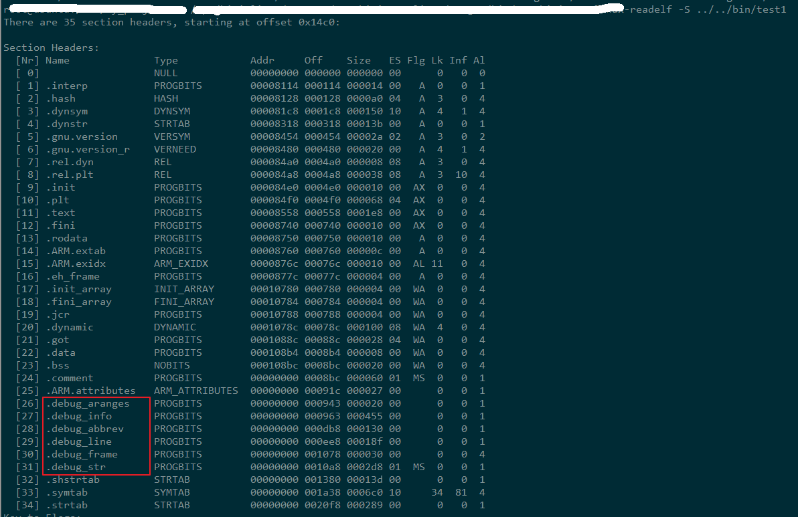

**xx not declared in this scope**
    
    error: ‘umask’ was not declared in this scope -> #include <sys/stat.h>
    error: ‘rlimit’ was not declared in this scope -> #include <sys/resource.h>

**查看动态链接库依赖关系**

    x86: ldd *.so
    arm: arm-linux-readelf -d *.so

**查看.so中导出函数**

    nm -D  **.so  
    但这样能看到所有的导出，乱七八糟的很多，筛选用：  
    nm **.so | grep XX

**查看编译是否加入了调试信息**

    arm: arm-linux-readelf -S *.so

**make_symlink_library: System Error: Operation not supported**

[转载](http://blog.csdn.net/aflyeaglenku/article/details/50697219)  
在编遇到这个错误  
`cmake_symlink_library: System Error: Operation not supported`  
创建链接不成功，要确认当前帐户下是否有权限在编译的目录中有创建链接的权限  
我使用vmware，在win7机器的共享目录中编译，无法创建链接，就会提示上面的错误。  
解决办法是，把源码复制到linux的本地目录中，比如/home等，在本地目录中编译就不会有这个问题。  
另外，从linux中拷贝符号链接到windows机器的共享目录时，也会提示错误导致无法拷贝，也是这个原因。你可以使用xshell等将符号链接拷贝出来
